# User guide

How to use Elysion (a short German version: [Benutzerhandbuch](./user-guide.de.md)): boards and rooms, working together on a canvas, sharing, and running a workshop with the timer and the dot voting.
To run Elysion first see [self-hosting](./self-hosting.md) or the demo in the [README](../README.md#demo). The screenshots are from the demo
stack with two people, `guest` and `dev`, working on a retrospective board.

## Log in

Open Elysion in the browser (<http://localhost> in the demo). You are sent to the login page of the identity provider (Keycloak); the demo has
the users `dev`, `dev1` and `dev2`, and the password is the username. Somebody has to log in once before they can be added to a board or a
room by their e-mail address.

## Boards and rooms

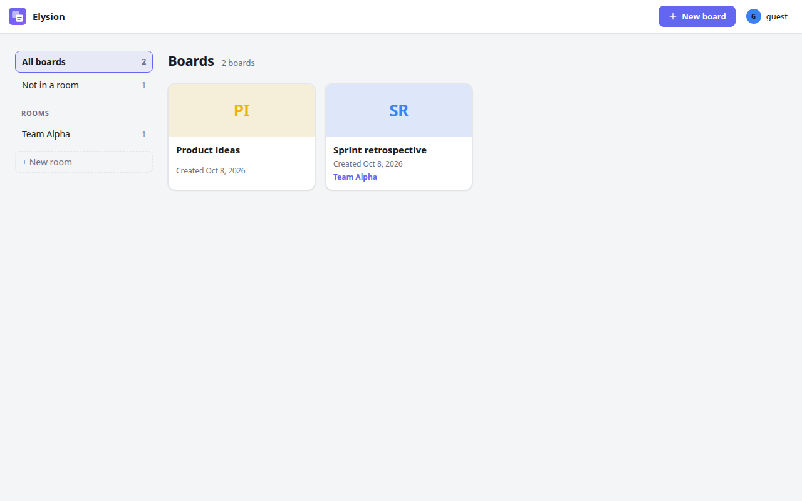

The start page lists **your boards**: the ones you made and the ones shared with you. A card shows the board's initials, its name and the date
it was made; the room it is in is shown as a small label.

- **New board** opens a form with the name and **Start from**: a blank board or a template (Brainstorming, Kanban, Retrospective, and your own,
  see [Templates](#templates)).
- On a card, the icons in the corner **move** the board to a room, **duplicate** it and **delete** it (delete asks first and cannot be undone).
- **Rooms** (the list on the left) are shared spaces for the boards of a team. **+ New room** makes one; the room's page has **Rename**,
  **Members** and **Delete room**. Everybody in a room can open its boards, with the role they have in the room (owner, editor or viewer);
  a board can also be shared with people on its own. Drag a card onto a room, or use the move icon, to put a board in it.

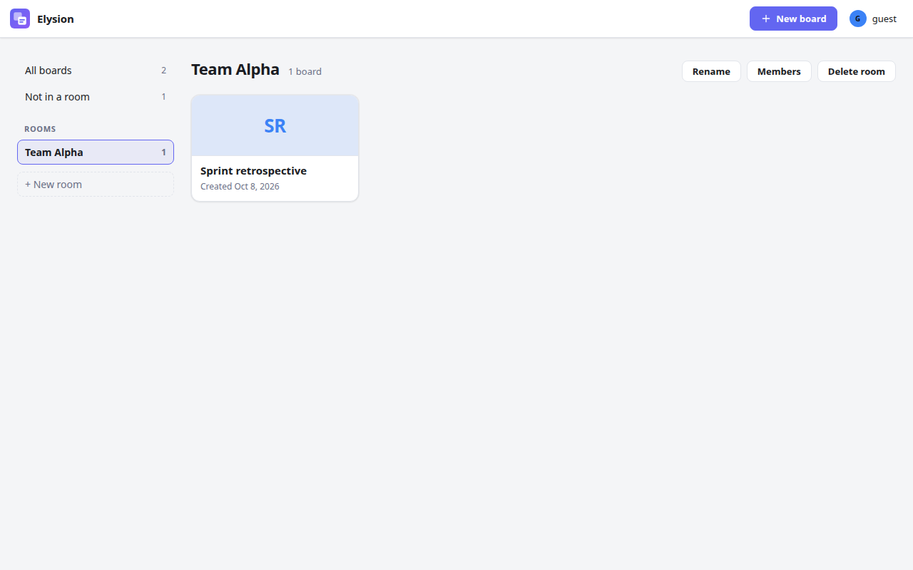

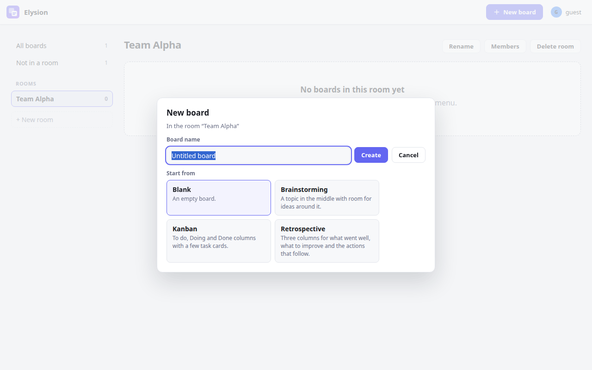

## The board

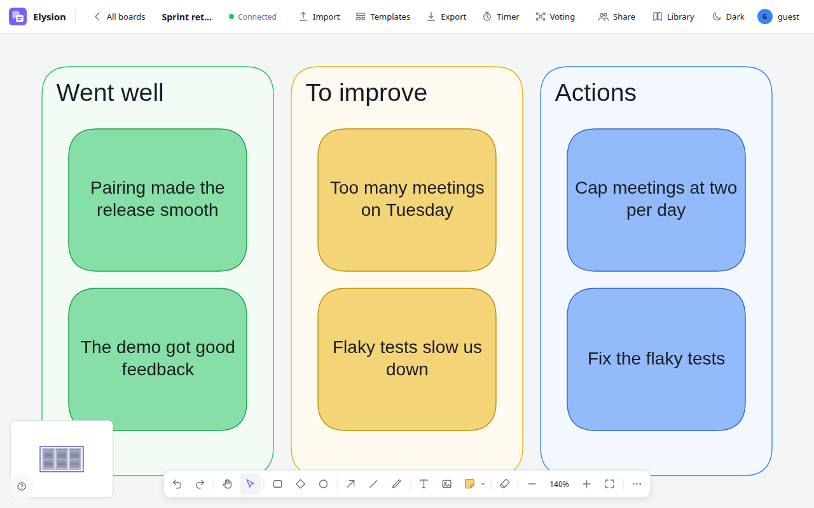

A board is an endless canvas (drawn by [Excalidraw](https://excalidraw.com)) that everybody on it edits at the same time. **Connected** in the top
bar means your changes are being sent; if the connection drops, Elysion reconnects by itself and merges what happened meanwhile.

**Top bar, from the left:** _All boards_, the board's name (click to rename), the connection state, **Import** (an `.excalidraw` file into this
board), **Templates**, **Export**, **Timer**, **Voting**, then **Share**, the people on the board, **Library**, the theme and your account menu.

**The toolbar at the bottom** has undo and redo, the hand (move the view), the selection tool, rectangle, diamond, ellipse, arrow, line, freehand
drawing, text, the **sticky note**, the eraser, and the zoom controls (zoom out, the zoom level, zoom in, fit the board in the window), and **Insert image**. An image is a PNG, JPEG, GIF, WebP or SVG file of up to 4 MB
(a board holds up to 200); choose it, paste it or drop it on the board. **Several files dropped together** are laid out in a row at the drop point (a paste
puts them in the middle of what you see), each at most half as high as your view and with its proportions kept, and they are selected so that you can move them
together. An SVG is turned into a picture (PNG) first. The others see the images a moment later, and they are still there after a reload. A viewer sees the
images but cannot add any. A file that is too large, of another type or one too many is refused with a message that names it and does not stay on the board.
The `⋯` button opens the canvas menu with the grid settings, among others: **Show grid** (a quiet dot grid in the background; `Ctrl+'` toggles it), **Snap to grid** (elements line up on the grid points, whether the dots are shown or not), **Snap to objects** (while you drag or resize, an element snaps to the edges and centers of the others, with red guide lines) and the grid size. The grid and the guides are on by default and belong to the board: everybody on it sees the same ones, and only editors change them. The small **map** at the bottom left shows the whole board and
the part you see; click or drag in it to move there.

### Sticky notes

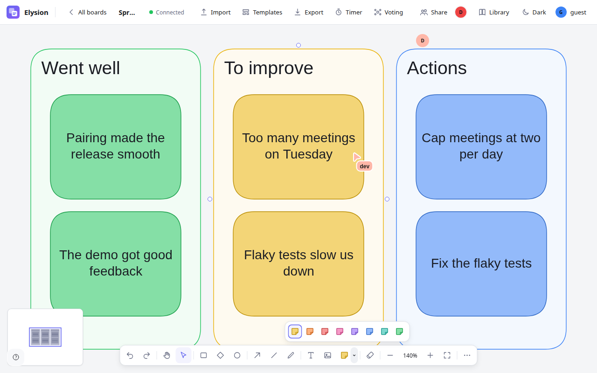

The sticky note button makes a note in the current color (or press **N**). The small arrow next to it opens the eight colors: yellow, orange,
red, pink, purple, blue, teal and green. Double-click a note to write in it. Notes, shapes and arrows work as in Excalidraw: drag to move,
drag the handles to resize, and the property panel on the left appears when something is selected.

### Connecting things

Hover a shape to see its connection points and drag from one to another shape to draw an arrow that stays attached when the shapes move.
Select exactly two shapes and a **Connect** button appears that joins them.

### Seeing each other

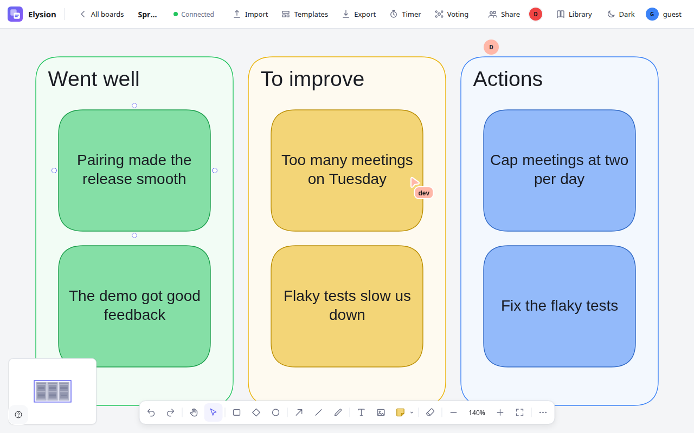

Everybody on the board has a color. You see **their cursor with their name**, and their initial next to **Share** in the top bar. Changes
by different people are merged without conflicts, even when two people edit the same board at the same moment.

### Light and dark

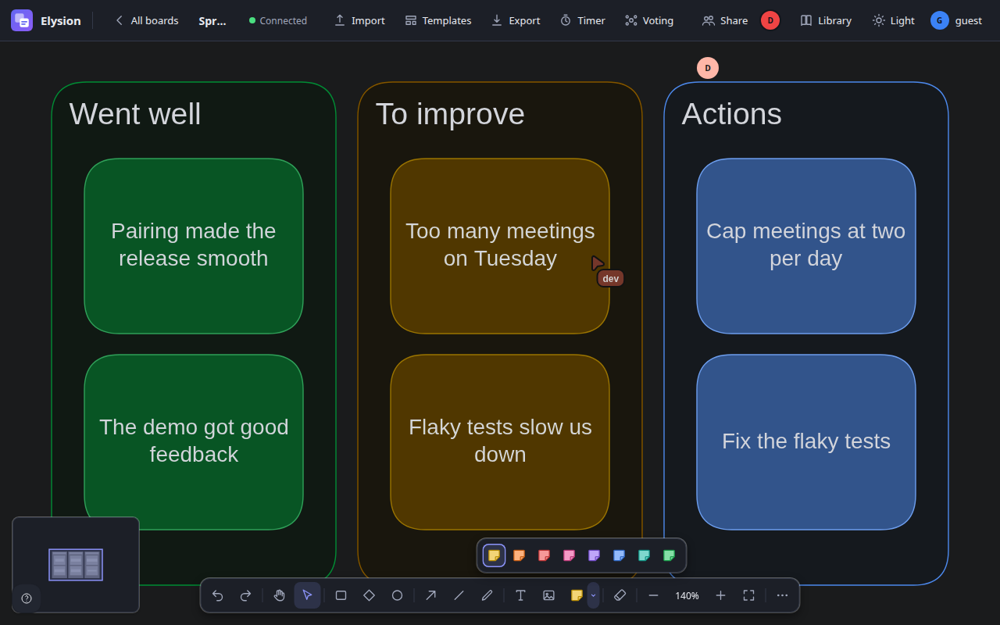

**Dark** / **Light** in the top bar switches the theme. Without a choice Elysion follows your system setting. The choice is kept in your browser.
In the dark theme Excalidraw darkens the whole canvas, so notes look darker than in the light theme; what everybody else sees is unchanged.

### The shape library

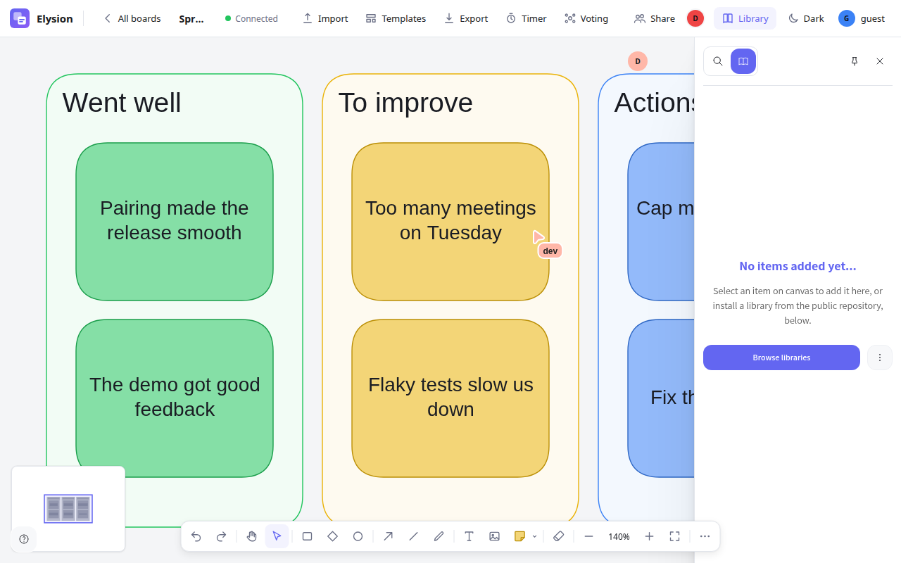

**Library** opens Excalidraw's library next to the canvas. It starts empty: select something on the board to add it, and click an item later to place it again, or press **Browse libraries** to install a public one.

## Sharing a board

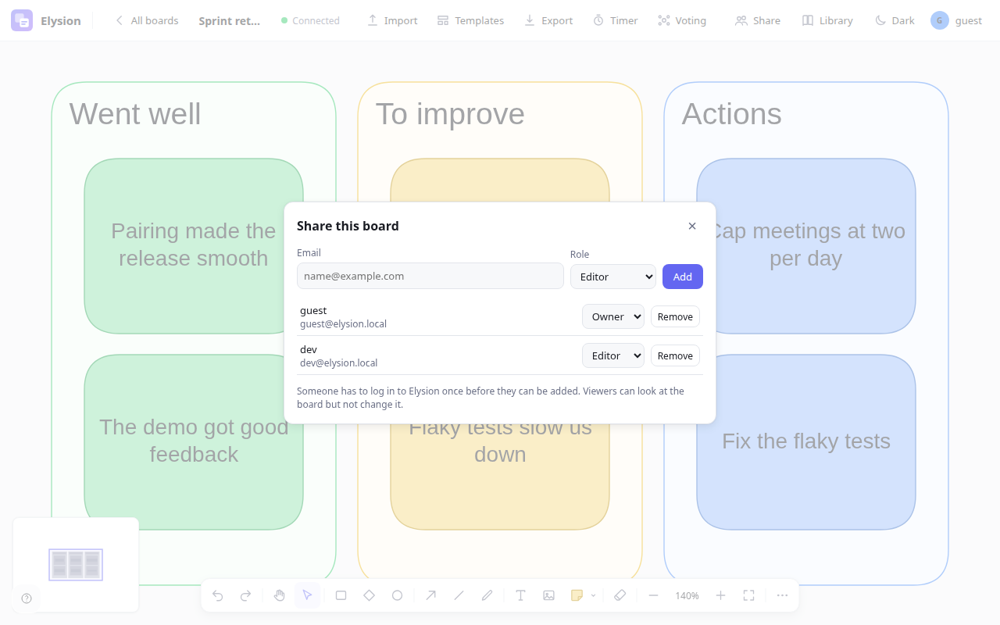

**Share** (for the owner) lists who has access. Type an **e-mail address**, choose a **role** and press **Add**:

| Role       | Can                                                                            |
| ---------- | ------------------------------------------------------------------------------ |
| **Owner**  | Everything, including sharing and deleting the board                           |
| **Editor** | Change the board, use the timer and the voting, add templates                  |
| **Viewer** | Look at the board and follow the others live; the server refuses their changes |

Change a role in the list, or **Remove** somebody. A person has to have logged in to Elysion once before they can be added. For a whole team
use a room instead: its members have access to all its boards.

## Templates

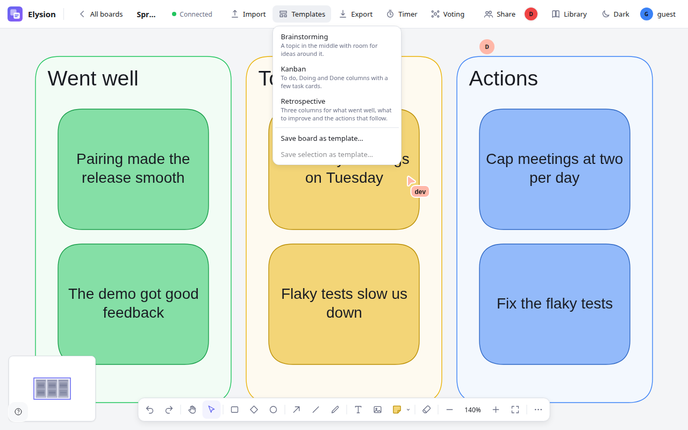

**Templates** adds a template to the board you have open: _Brainstorming_ (a topic in the middle), _Kanban_ (To do, Doing, Done),
_Retrospective_ (went well, to improve, actions). **Save board as template…** and **Save selection as template…** keep your own for later; they
show in this menu and in the **New board** form. Viewers do not see the menu.

## Export and import

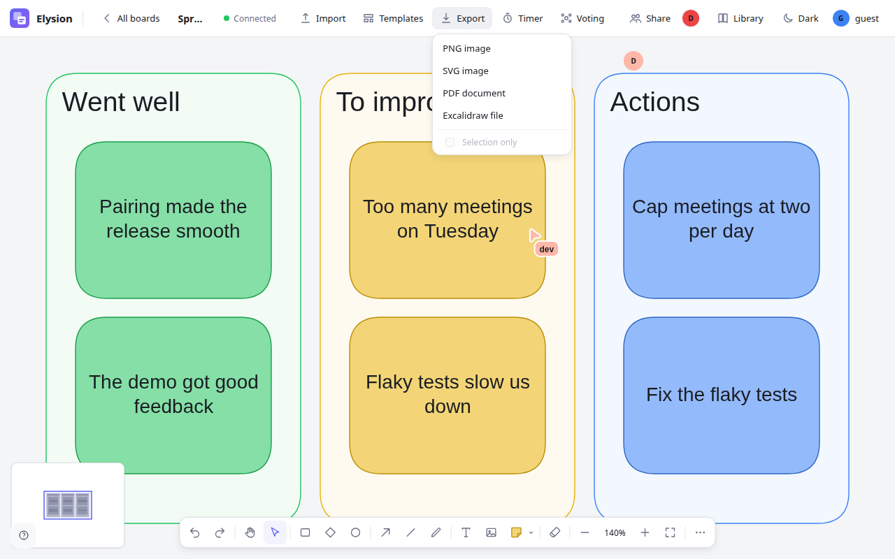

**Export** saves the board as a **PNG** or **SVG** image, a **PDF** document or an **Excalidraw file** (`.excalidraw`). With **Selection only**
(when something is selected) only that part is exported.

The **Options** below the formats are remembered in your browser: for a **PDF**, whether a board that has frames makes **one page per frame** (in the
order of the frames' names when they are numbered, like the pages of an imported PDF, otherwise from the top left to the bottom right; each page has
the frame's name as its title and as a bookmark) or puts the whole board on one page, the **page size** (the size of the content, A4 or Letter) and the
**orientation**; for every format the **colors** (as on the screen, light or dark), the **background** (off leaves it transparent) and, for a **PNG**,
the **scale** (1×, 2× or 3×). With **Selection only** and frames selected, only those frames become pages. Images on the board are part of the file. **Import** takes an `.excalidraw` file into the board you have open.
(when something is selected) only that part is exported. **Import** takes an `.excalidraw` file into the board you have open (it replaces what is on the board, and asks first) or a PDF (below).

### Bring a PDF onto the board

Choose a `.pdf` file with **Import**, or drop one on the board. A window shows the pages as small pictures: leave out the pages you do not need (all of
them are chosen at first, the first 50 of a longer PDF can be imported), choose how sharp they should be (1,600 pixels wide is a good size for a screen) and
click **Import**. Each page becomes a picture in a frame named **Page 1**, **Page 2**, and so on; the frames sit in a grid in the middle of what you see, the
others see them a moment later, and **Undo** takes all of them off again in one step. The PDF is read in your browser and never sent to a server; only the
pictures of the pages are stored. A PDF that is protected by a password, larger than 10 MB or not a PDF is refused with a message, and the progress of a long
PDF is shown per page and can be canceled.

## Running a workshop

The timer and the voting are for the people who lead a session. Everybody on the board sees them, and both can be used by owners and editors.

### The timer

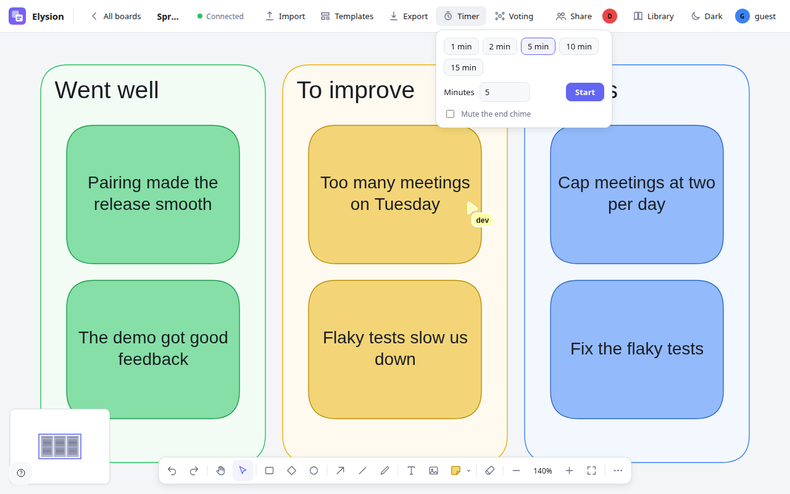

**Timer** opens a menu: pick 1, 2, 5, 10 or 15 minutes (or type a number) and press **Start**. The countdown shows in the top bar **for
everybody on the board**, and a short chime sounds when time is up (**Mute the end chime** if you do not want it).

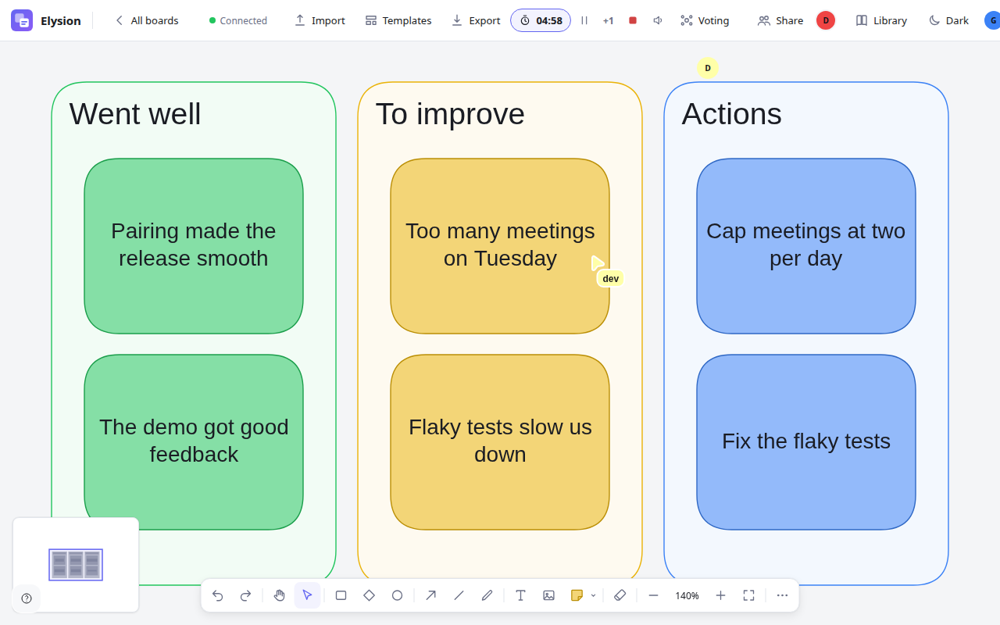

While it runs the top bar has **pause** (and resume), **+1** to add a minute, **stop** (the red square) and the chime switch. The timer is
part of the board, so somebody who joins later or reloads sees the time that is left.

### Dot voting

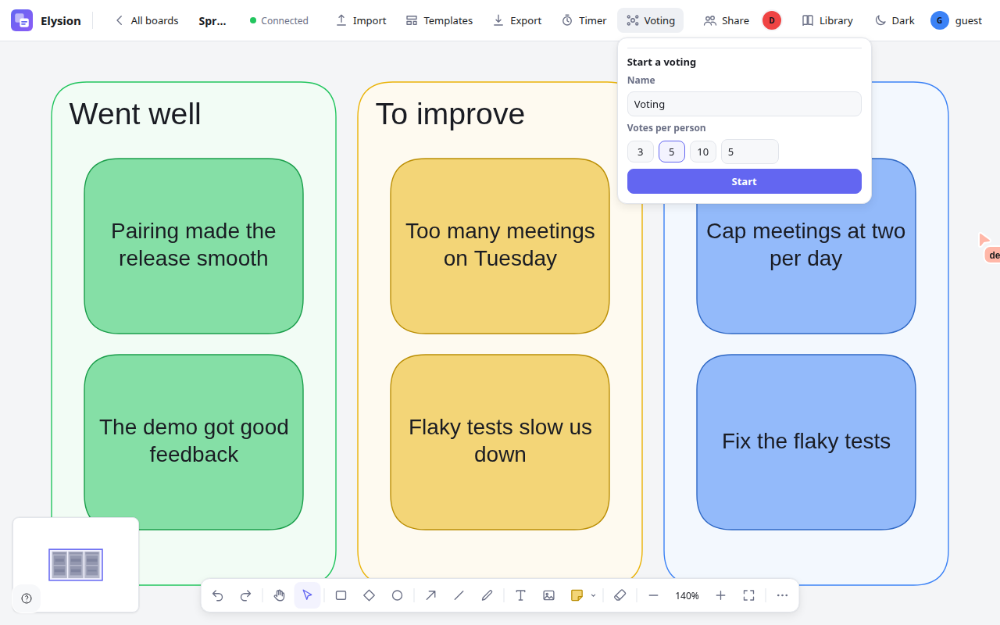

1. **Voting** opens a form: a **name** and the **votes per person** (3, 5, 10 or your own number). Press **Start**.
2. While the voting is open, **click an element** (a sticky note, a shape) to give it a vote. Small dots at its corner are your own votes; click
   a dot to take that vote back. The button in the top bar and a hint above the toolbar say how many votes you have left.

   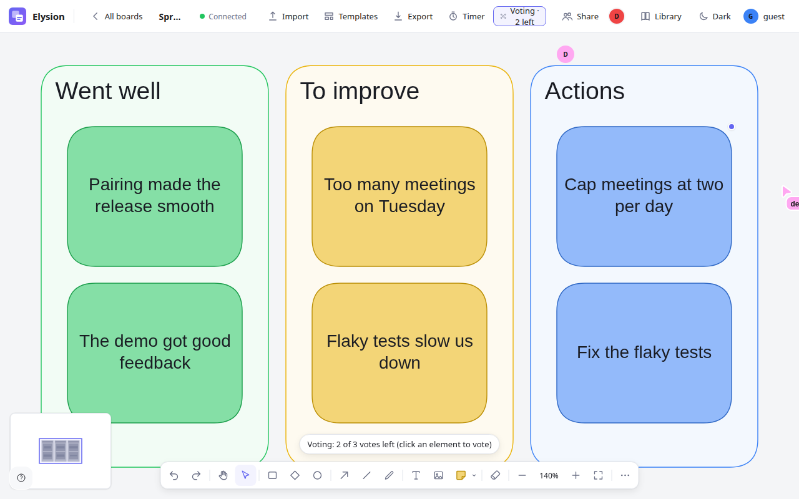

3. The voting ends when the facilitator presses **End voting**, **or by itself when everybody who is on the board and may vote has used all their
   votes**.
4. The **results** open for everybody in a small window on the right: the elements that got votes, the most voted first, with the number of
   votes. Click a result to jump to the element. The window can be moved by its title and does not block the board.

   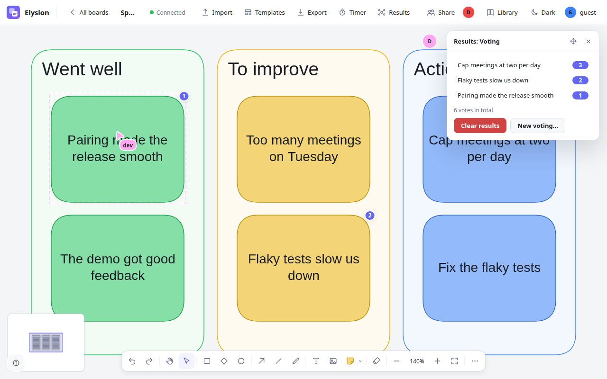

   Owners and editors can **Clear results** (the second press confirms) or start **New voting…**. Somebody who joins afterwards opens the
   results with the **Results** button.

While a voting is open you only see **your own** votes, never anybody else's, and the results show counts without names. Viewers see the
voting and its results but cannot vote. This anonymity is a promise of the interface, not of the system (see [what is missing](../README.md#what-is-missing)).

## Tips

- **Zoom to fit** (the last zoom button) when you are lost; the map at the bottom left shows where you are.
- **Duplicate** a board from its card to start the next session from the same layout.
- Use a **room** per team and put the team's boards in it, then add people once, to the room.
- Keep the **timer** and the **voting** for the session's leader; give everybody else the **Editor** role, and people who only follow, **Viewer**.
